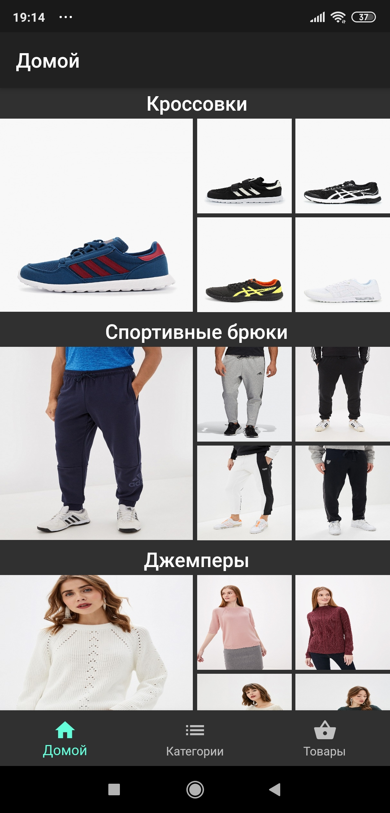
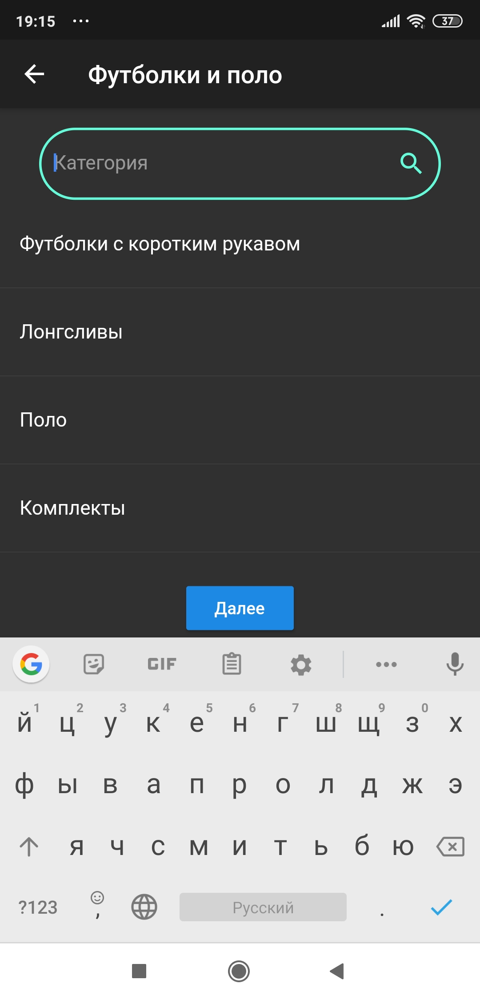
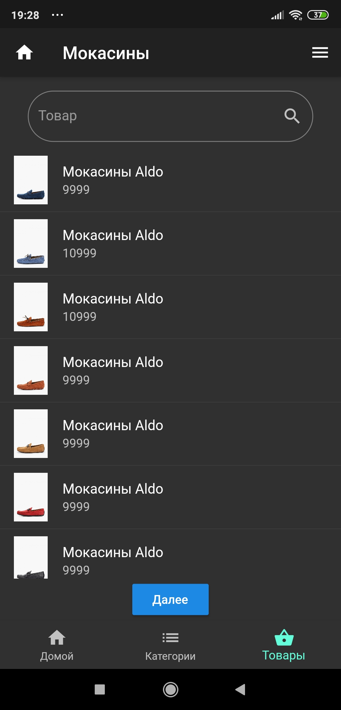
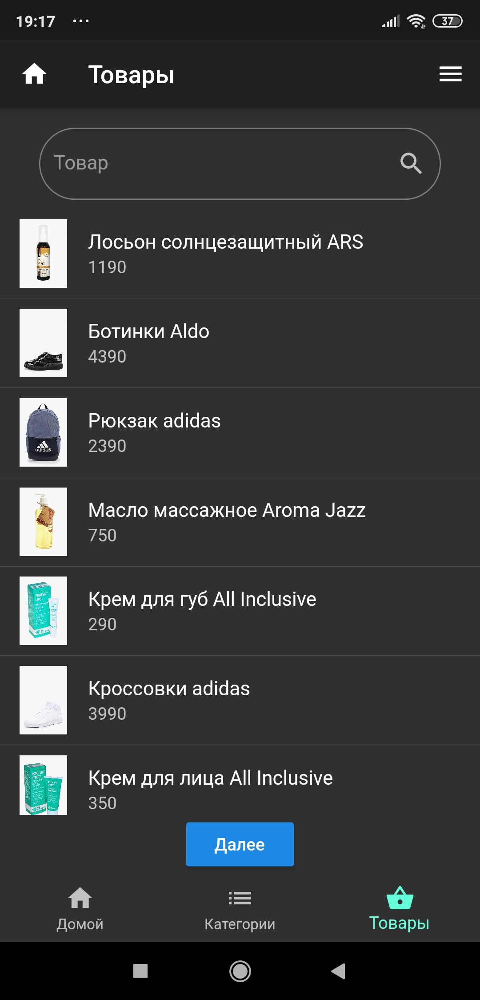
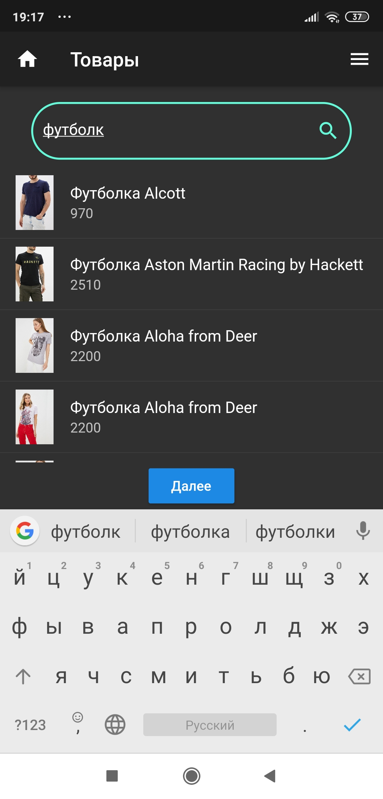
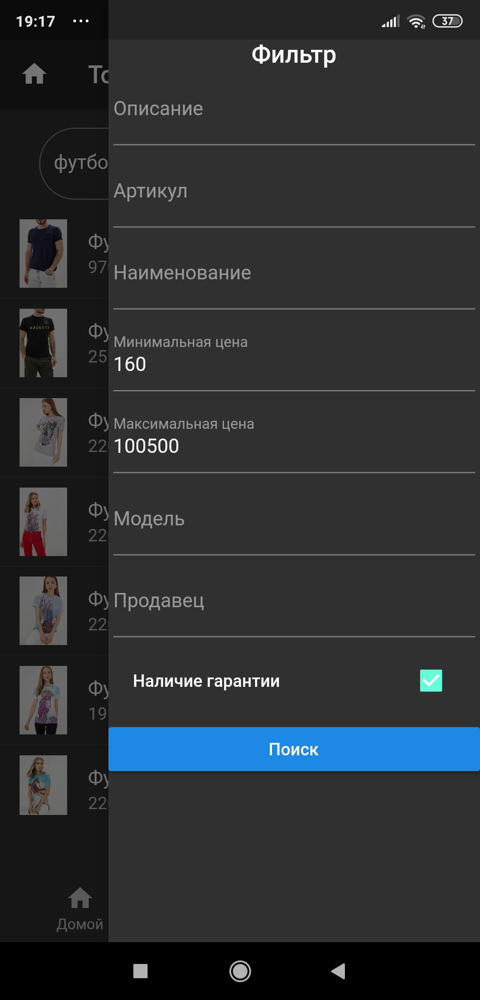
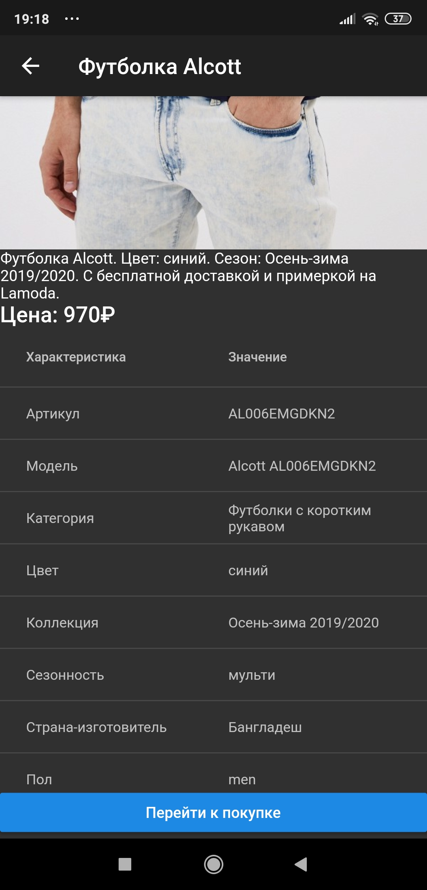
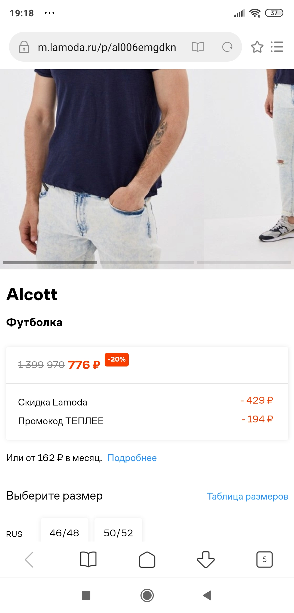

# outfit_shop_client

Get Outfit Shop Client










## Building

### Debug

```bash
cd outfit_shop_client
flutter run
```

### Release

Android APK:
```bash
cd outfit_shop_client
flutter build apk
```
App bundle:
```bash
cd outfit_shop_client
flutter build appbundle
```

IOS:
```bash
cd outfit_shop_client
flutter build ios
```

